**チュートリアルの言語切り替えについては、以下のアニメーション画像をご参照ください。**

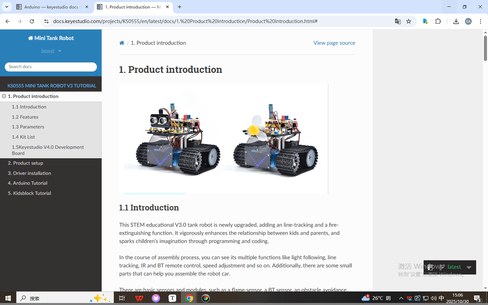

 [Arduino Tutorial](./Arduino/Arduino.7z) 

 [Kidsblock Tutorial](./Kidsblock/Kidsblock.7z) 

# 1. 製品紹介

## 1.1 はじめに

このSTEM教育用V3.1タンクロボットは新たにアップグレードされ、ライントラッキングと消火機能が追加されました。プログラミングとコーディングを通じて、子供と保護者の絆を強め、子供たちの想像力を刺激します。

組み立てプロセスの中で、ライトフォロー、ライントラッキング、IRおよびBTリモートコントロール、速度調整など、複数の機能を確認できます。また、ロボットカーの組み立てに役立つ小さなパーツもあります。

炎センサー、BTセンサー、障害物回避センサー、ライントラッキングセンサー、超音波センサーなど、基本的なセンサーとモジュールが含まれています。

Arduino IDE のC言語コードと KidsBlock グラフィカルプログラミングの2種類のチュートリアルは、さまざまな年齢の愛好家にも適しています。

これはまさに最良の選択です。

## 1.2 特徴

1. 多機能：領域制限、ライントラッキング、消火、ライトフォロー、IRおよびBTリモートコントロール、速度制御など。

2. 簡単な組み立て：いくつかのパーツでロボットを組み立て。

3. 高い耐久性：アルミ合金ブラケット、金属モーター、高品質ホイール。

4. 高い拡張性：モータードライバーシールドとLEGOパーツを通じて多くのセンサーやモジュールを接続可能。

5. 複数の制御方法：IRリモートコントロール、アプリコントロール（iOSおよびAndroidシステム）。

6. 基本プログラミング：Arduino IDE のC言語コードと KidsBlock グラフィカルプログラミング。

## 1.3 仕様

- 動作電圧：5V

- 入力電圧：6-9V

- 最大出力電流：1.5A

- 最大消費電力：32W

- モーター速度：5V 200 rpm/分

- モータードライブ方式：デュアルHブリッジドライブ（HR8833）

- 超音波感知角度：\<15°

- 超音波検知距離：2cm-300cm

- 赤外線リモートコントロール距離：10メートル（実測値）

- BTリモートコントロール距離：30メートル（実測値）

## 1.4 キット内容

| No.  |                 名称                  | 数量  |                           画像                            |
| ---- | :-----------------------------------: | ---- | :----------------------------------------------------------: |
| 1    |            ボトムアセンブリ            | 1    | 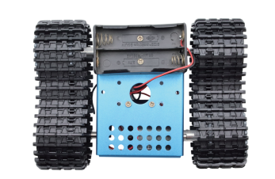 |
| 2    |           開発ボード           | 1    |               |
| 3    |     モータードライバー拡張ボード      | 1    |              |
| 4    |             BLE BTモジュール             | 1    | 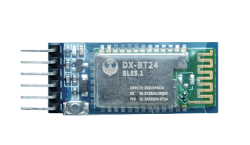 |
| 5    |       HC-SR04 超音波センサー       | 1    |       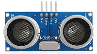        |
| 6    |      Keyestudio 8\*16 LEDパネル       | 1    |       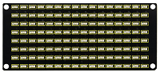        |
| 7    |           黄色LEDモジュール           | 1    |       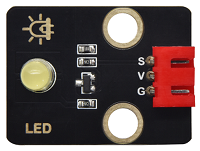       |
| 8    |             炎センサー              | 2    |              |
| 9    |           130モーターモジュール            | 1    |       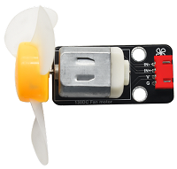       |
| 10   |             フォトレジスター             | 2    |              |
| 11   |   8\*16 LEDパネル用アクリルボード   | 1    |              |
| 12   |           トップアクリルボード           | 1    |       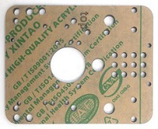       |
| 13   |             アクリルボード             | 1    |            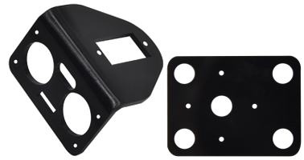            |
| 14   |            リモートコントロール             | 1    |             |
| 15   |                 サーボ                 | 1    | 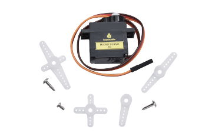 |
| 16   |               USBケーブル               | 1    | 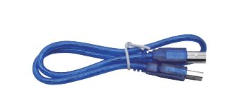 |
| 17   |             巻きパイプ              | 1    | 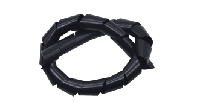 |
| 18   |         3.0\*40MM ドライバー         | 1    |               |
| 19   |             3\*100MM 結束バンド             | 5    |               |
| 20   |          L型 M2.5 レンチ           | 1    | 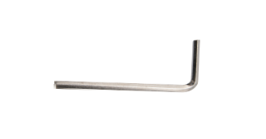 |
| 21   |           L型 M3 レンチ            | 1    | 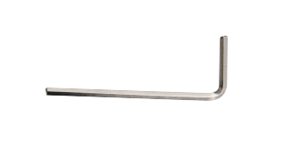 |
| 22   |          L型 M1.5 レンチ           | 1    | 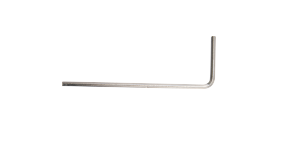 |
| 23   |               段ボール               | 1    |               |
| 24   |  4P M-F PH2.0mm to 2.54 デュポンワイヤー   | 1    | 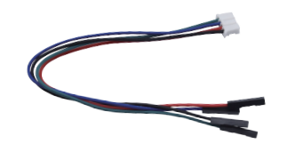 |
| 25   |        4P HX-2.54 デュポンワイヤー         | 1    | 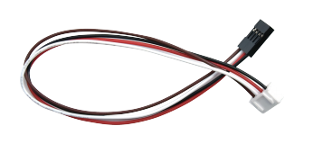 |
| 26   |      5P JST-PH2.0MM デュポンワイヤー       | 1    | 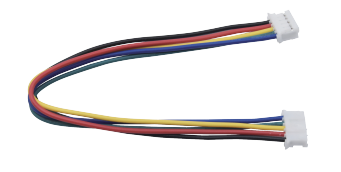 |
| 27   |   3P-3P XH2.54 to 2.54 デュポンワイヤー    | 1    |       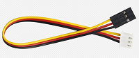       |
| 28   |   3P-3P XH2.54 to PH2.0 デュポンワイヤー   | 2    |           |
| 29   |   4P-3P XH2.54 to PH2.0 デュポンワイヤー   | 2    |      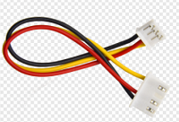       |
| 30   |    4P XH2.54 to PH2.0 デュポンワイヤー     | 1    | 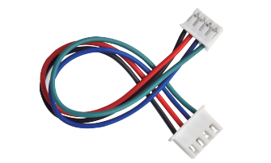 |
| 31   |      M1.4\*8MM 丸頭ネジ      | 6    | 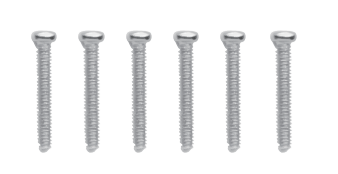 |
| 32   |               M1.4 ナット               | 6    | 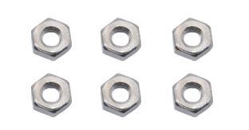 |
| 33   |                M2 ナット                | 8    | 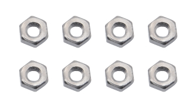 |
| 34   |       M2\*8MM 丸頭ネジ       | 8    | 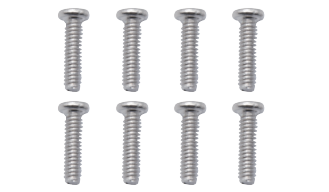 |
| 35   |      M1.2\*5MM 丸頭ネジ      | 6    | 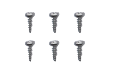 |
| 36   |       M3\*6MM 丸頭ネジ       | 18   | 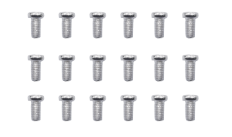 |
| 37   |       M3\*10MM 皿頭ネジ       | 3    | 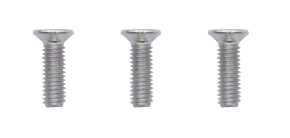 |
| 38   |                M3 ナット                | 3    | 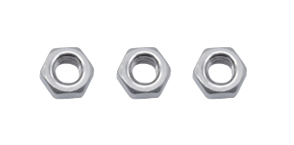 |
| 39   |   M3\*10MM 両通し銅柱    | 4    | 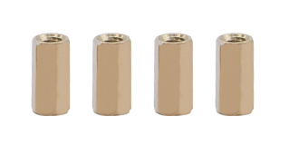 |
| 40   |    M3*45MM 両通し銅柱    | 4    | 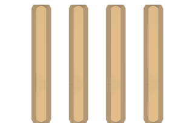 |
| 41   | テクニックアクスルピン（摩擦リッジ付き） | 11   | 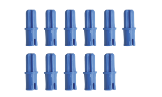 |
| 42   |          4265c テクニックブッシュ           | 11   | 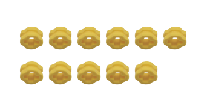 |
| 43   |            青ジャンパーキャップ            | 4    | 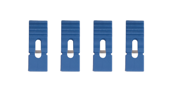 |
| 44   |            赤ジャンパーキャップ             | 4    | 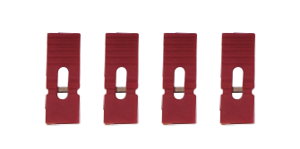 |
| 45   |        片口スパナ         | 1    | 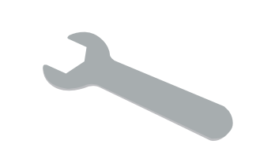 |
| 46   |        両口スパナ         | 1    | 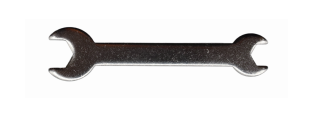 |

## 1.5 Keyestudio V4.0 開発ボード

このスマートカーのコアは Keyestudio V4.0 開発ボードであることを理解しておく必要があります。

Keyestudio V4.0 開発ボードは ATmega328P MCU をベースにしており、UART-USB変換チップとして CP2102 チップを搭載しています。

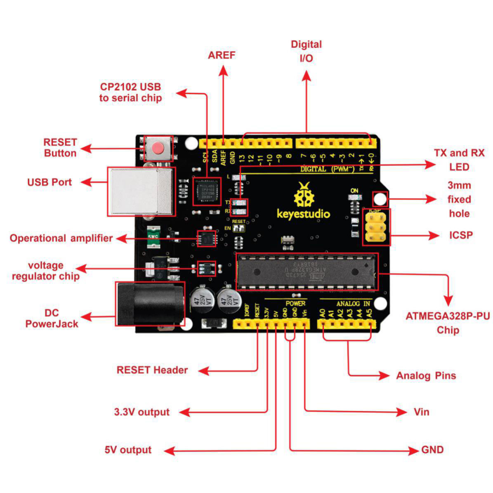

14本のデジタル入出力ピン（うち6本はPWM出力として使用可能）、6本のアナログ入力、16MHz水晶振動子、USB接続、電源ジャック、2つのICSPヘッダー、およびリセットボタンを備えています。

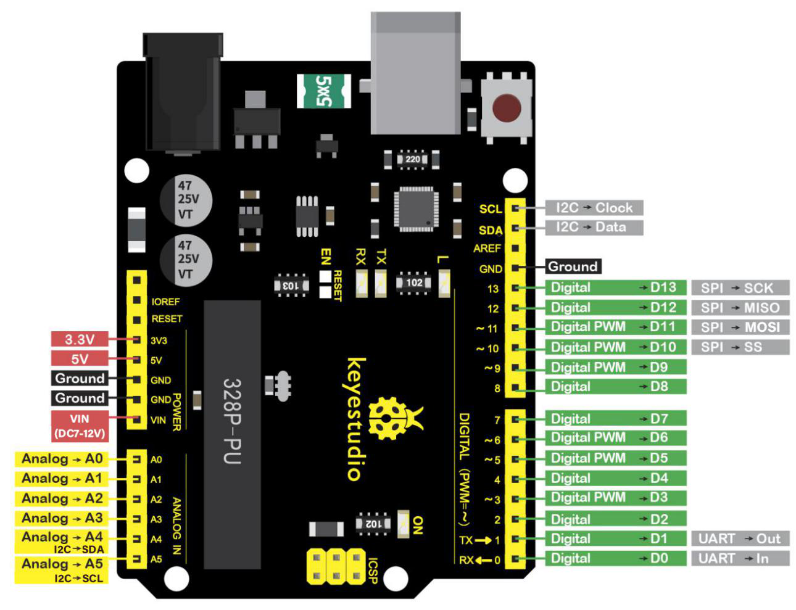

USBケーブル、外部DC電源ジャック（DC 7-12V）、またはメスヘッダー Vin/GND（DC 7-12V）で電力を供給できます。

|      マイクロコントローラー       |                      ATmega328P-PU                       |
| :-------------------------: | :------------------------------------------------------: |
|      動作電圧      |                            5V                            |
| 入力電圧（推奨） |                         DC7-12V                          |
|      デジタル I/O ピン       |       14 (D0-D13)  （うち6本はPWM出力）       |
|    PWM デジタル I/O ピン     |               6 (D3, D5, D6, D9, D10, D11)               |
|      アナログ入力ピン      |                        6 (A0-A5)                         |
|   I/O ピンあたりのDC電流    |                          20 mA                           |
|   3.3V ピンのDC電流   |                          50 mA                           |
|        フラッシュメモリ         | 32 KB (ATmega328P-PU)（うち0.5KBはブートローダーが使用） |
|            SRAM             |                   2 KB (ATmega328P-PU)                   |
|           EEPROM            |                   1 KB (ATmega328P-PU)                   |
|         クロック速度         |                          16 MHz                          |
|         LED_BUILTIN         |                           D13                            |